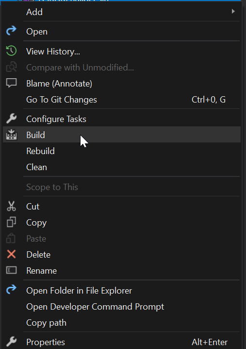
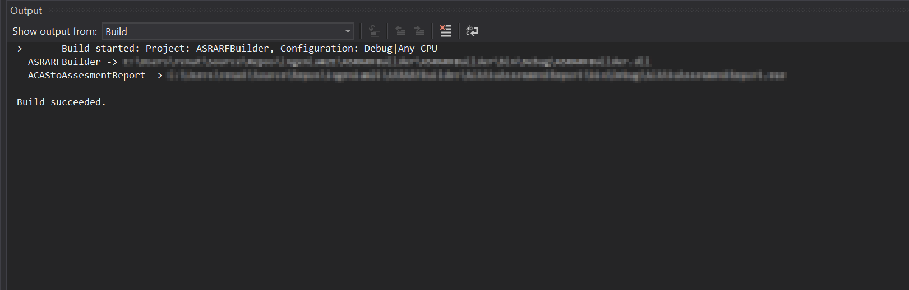
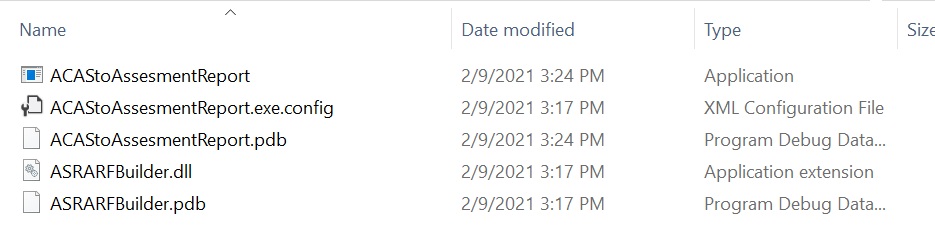
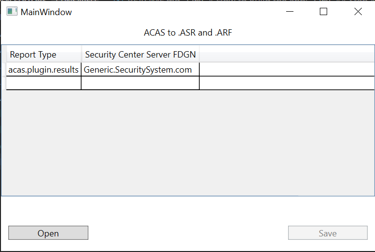

# ASRARFBuilder
Library for converting ACAS .nessus scan to ARF and ASR result files

# How to Build the app:
## Step 1: Open Visual Studio
VSCode may not work (at least I couldn't get it to work with it)

## Step 2: Navigate and right click on the file ASRARFBuilder.sln
Click on "Build"

You will see this at the bottom:

## Step 3: Navigate to the location of your repository/ACAStoAssessmentReport/bin/Debug 
you will see the EXE you need to run

## Step 4: double click on the EXE and this box will pop up

Click “Open” and select the .nessus file (one at a time). The window will not change anything when it is selected. This appears to be normal. 

Just click save, and select the location to save the ASR and ASF files. You should see a quick progress bar (it may be too quick to see in some cases).

The ASR and ASF XML files will be in your selected directory.

Repeat for all needed .nessus files.
